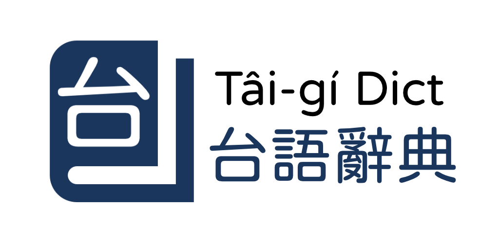

# 台語辭典



[](https://apps.apple.com/tw/app/%E5%8F%B0%E8%AA%9E%E8%BE%AD%E5%85%B8/id6763974066)
[](https://play.google.com/store/apps/details?id=org.taigidict.app)
[](https://github.com/PhoenixEmik/taigi-dict/releases/latest)


[正體中文說明](README.zh-Hant.md)

Offline Taiwanese Hokkien and Mandarin dictionary project built around the
Ministry of Education dataset.

This repository currently contains multiple app implementations that share the same
product scope:

- Native Swift / SwiftUI app in `ios-native/` for current iOS development
- Native Kotlin / Jetpack Compose app in `android-native/` for current Android development
- Archived Flutter app in `flutter-archive/` as the first-generation implementation

The current native apps focus on offline lookup, downloadable audio archives,
bookmarks, localized UI, and reference material for Tailo and Hanji usage.
The archived Flutter app preserves the first-generation implementation for reference.

## Project Status

- Android: native rewrite is maintained from `android-native/`
- iOS: maintained from `ios-native/` with `TaigiDictNative.xcworkspace`
- Legacy Flutter implementation: archived under `flutter-archive/` as historical/reference code

## Core Experience

The product is organized around three primary tabs:

- `Dictionary`: search Taiwanese headwords, Tailo romanization, and Mandarin definitions; reopen recent searches; drill into a dedicated detail page
- `Bookmarks`: save entries and reopen them later
- `Settings`: manage offline resources, appearance, language, reference material, and app information

## App Identity

- Dart package name: `taigi_dict`
- App display name: `台語辭典`
- Android application ID: `org.taigidict.app`
- iOS bundle identifier: `org.taigidict.app`
- Current native app version: `1.3.5` (build `8`)
- Archived Flutter package version: `1.3.0+3`
- Official project domain: `https://taigidict.org`
- Production asset host: `https://app.taigidict.org/assets/`

## Features

- Search Taiwanese headwords, Tailo romanization, and Mandarin definitions with weighted ranking and recent search history
- Open dedicated entry detail pages with linked definitions and native share support
- Save entries to bookmarks and reopen them from a separate tab
- Download ministry word audio and example audio for offline playback
- Offer Traditional Chinese, Simplified Chinese, and English UI
- Adjust theme and reading text size
- Read built-in Tailo and Hanji reference pages plus about and license screens

## Data And Licensing

Canonical ministry references:

- Dictionary reference: `https://sutian.moe.edu.tw/zh-hant/siongkuantsuguan/`
- Copyright and licensing note: `https://sutian.moe.edu.tw/zh-hant/piantsip/pankhuan-singbing/`
- Source spreadsheet: `https://sutian.moe.edu.tw/media/senn/ods/kautian.ods`
- Tailo guide: `https://sutian.moe.edu.tw/zh-hant/piantsip/tailo-phiautsu-suatbing/`
- Hanji usage guide: `https://sutian.moe.edu.tw/zh-hant/piantsip/hanji-iongji-guantsik/`

Production offline resource endpoints used by the apps:

- Dictionary audio archive: `https://app.taigidict.org/assets/sutiau-mp3.zip`
- Example audio archive: `https://app.taigidict.org/assets/leku-mp3.zip`
- Raw dictionary source: `https://app.taigidict.org/assets/kautian.ods`

Important distribution note:

- The upstream raw data is under `CC BY-ND 3.0 TW`
- The archived Flutter app bundles the raw `kautian.ods` asset and builds the local SQLite database on-device
- Native Android app bundles the generated dictionary package under `android-native/Generated/Dictionary/` and does not parse `kautian.ods` at runtime
- Native iOS app bundles the generated dictionary package under `ios-native/Generated/Dictionary/` and does not parse `kautian.ods` at runtime

## Tech Stack

Archived Flutter implementation:

- Flutter with Material 3
- `dio` for resumable downloads
- `just_audio` for offline audio playback
- `flutter_open_chinese_convert` for runtime OpenCC conversion
- `shared_preferences` for settings, bookmarks, and recent searches
- `spreadsheet_decoder` for parsing `kautian.ods`
- `sqflite` for the local SQLite dictionary database

Native Android implementation:

- Kotlin and Jetpack Compose with Material 3
- AndroidX ViewModel, Kotlin coroutines, and Flow / StateFlow
- `Preferences DataStore` for app settings, bookmarks, and search history, with legacy preference migration
- custom SQLite import / repository as the default dictionary backend, with a Room-backed repository also present in the project
- `android-opencc` for OpenCC-based Chinese conversion

Native iOS implementation:

- SwiftUI
- local Swift package split into `TaigiDictCore` and `TaigiDictUI`
- `GRDB.swift` for SQLite access
- `SwiftyOpenCC` for Chinese conversion
- `ZIPFoundation` for offline archive handling

## Project Structure

- `android-native/`: native Kotlin / Jetpack Compose Android app
- `android-native/Generated/Dictionary/`: generated dictionary package bundled by the native Android app
- `ios-native/`: native Swift / SwiftUI iOS app, local Swift package, and tests
- `ios-native/Generated/Dictionary/`: generated dictionary package bundled by the native iOS app
- `flutter-archive/`: archived first-generation Flutter app and platform hosts
- `flutter-archive/lib/`: Flutter application code
- `flutter-archive/android/`: Flutter Android host project
- `flutter-archive/ios/`: Flutter iOS host project
- `flutter-archive/test/`: Flutter test suite
- `flutter-archive/assets/dictionary/kautian.ods`: bundled raw dictionary source used by the Flutter app
- `data/source/kautian.ods`: shared raw source file used by the conversion pipeline
- `tool/build_dictionary_asset.py`: shared dictionary conversion script used by the current native pipelines
- `ios-native/NativeApp/`: native iOS app entry point and asset catalog
- `ios-native/Sources/TaigiDictCore/`: shared dictionary, audio, bookmark, and conversion logic
- `ios-native/Sources/TaigiDictUI/`: SwiftUI screens for dictionary, bookmarks, settings, and info

## Run

Native iOS app:

- Open `ios-native/TaigiDictNative.xcworkspace` in Xcode
- Select the `TaigiDictNative` scheme
- Build and run on an iOS 17 simulator or device

Native iOS command-line build:

```bash
xcodebuild \
  -workspace ios-native/TaigiDictNative.xcworkspace \
  -scheme TaigiDictNative \
  -destination 'platform=iOS Simulator,name=iPhone 17' \
  build
```

For more native iOS details, see [`ios-native/README.md`](ios-native/README.md).

Native Android app:

```bash
cd android-native
./gradlew app:assembleDebug
```

Legacy Flutter archive:

```bash
cd flutter-archive
flutter pub get
flutter run -d android
```

## Verify

Native iOS package and shared logic:

```bash
swift test --package-path ios-native
```

Native iOS app build verification:

```bash
xcodebuild \
  -workspace ios-native/TaigiDictNative.xcworkspace \
  -scheme TaigiDictNative \
  -destination 'platform=iOS Simulator,name=iPhone 17' \
  build
```

Native Android app:

```bash
cd android-native
./gradlew testDebugUnitTest
./gradlew app:assembleDebugAndroidTest
```

Optional Android Room-backed verification:

```bash
cd android-native
./gradlew verifyRoomDebug
```

Legacy Flutter archive:

```bash
cd flutter-archive
flutter analyze
flutter test
```

## Development Notes

- Active iOS product work happens in `ios-native/`
- Active Android product work happens in `android-native/`
- The legacy Flutter implementation is kept under `flutter-archive/`
- `flutter-archive/pubspec.yaml` pins `path_provider_foundation` with `dependency_overrides` to `2.6.0`
- `spreadsheet_decoder` is a git dependency in the archived Flutter project, so Flutter dependency resolution is not fully pub.dev-only

## Build Release APK

```bash
cd android-native
./gradlew :app:assembleRelease
```

Generated artifact:

- `android-native/app/build/outputs/apk/release/app-release.apk`

## Privacy Policy

- Bilingual English / Traditional Chinese: `PRIVACY_POLICY.md`

## Acknowledgments

- Ministry of Education Taiwanese Hokkien Dictionary: `https://sutian.moe.edu.tw/`
- Tauhu-oo 20.05 font for Taiwanese Hanzi and specific CJK Extension glyph coverage: `https://github.com/tauhu-tw/tauhu-oo`
- jf open-huninn font used in the app icon artwork: `https://github.com/justfont/open-huninn-font`
- Open Chinese Convert for Flutter for runtime OpenCC conversion: `https://github.com/zonble/flutter_open_chinese_convert`
- android-opencc for native Android OpenCC conversion: `https://github.com/xyrlsz/android-opencc`
- GRDB.swift: `https://github.com/groue/GRDB.swift`
- ZIPFoundation: `https://github.com/weichsel/ZIPFoundation`
- SwiftyOpenCC: `https://github.com/PhoenixEmik/SwiftyOpenCC`

## License

- App code: MIT. See `LICENSE`.
- Dictionary data: `CC BY-ND 3.0 TW`. See `DATA_LICENSE.md`.
- Dictionary audio: `CC BY-ND 3.0 TW`. See `DATA_LICENSE.md`.
- Ministry copyright note: `https://sutian.moe.edu.tw/zh-hant/piantsip/pankhuan-singbing/`
